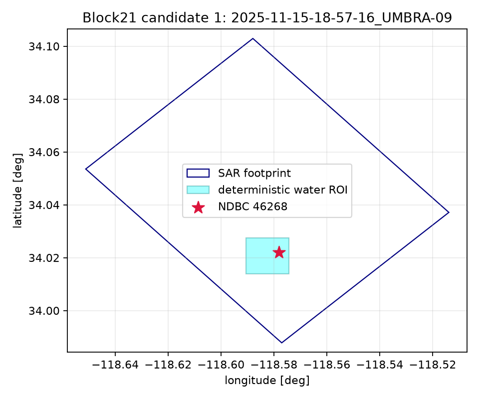

# Candidate 1 — 2025-11-15-18-57-16_UMBRA-09

- Collect: `e6b4c32d-bda9-4f75-a9a4-8dcfe0291a4f` at 2025-11-15T18:57:16.800000Z
- Complex path: SICD=True, CPHD=False; catalog duration 7.6 s (descriptor, not gate).
- Internal-water ROI: 1500 m square; edge clearance 2127.1 m; coast status `local_exact`.
- Measured reference: NDBC `46268`, 0.44 km, offset 163 s.
- Dominant same-band period: 15.38 s; propagation-to direction: 24.0 deg.
- Frequency readiness: **READY_FOR_SAR_METADATA_PREFLIGHT**. Bathymetry is not a selection gate.

