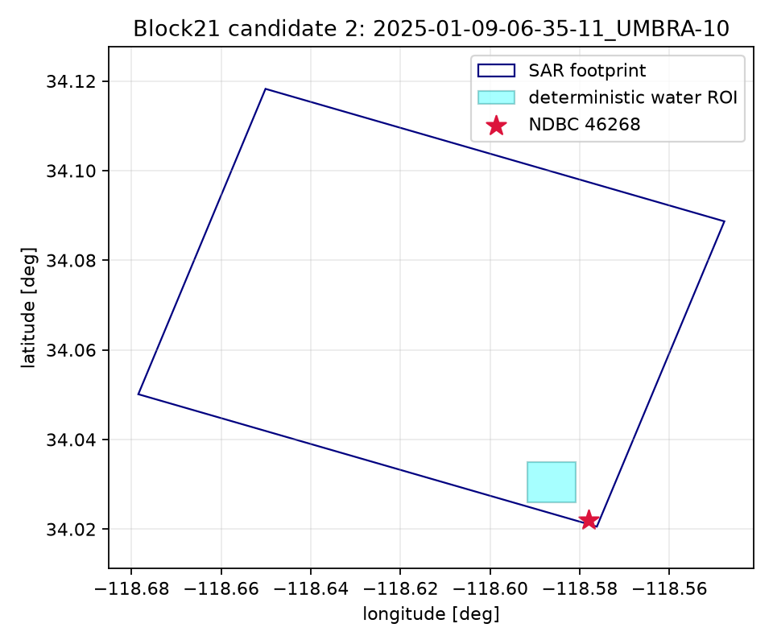

# Candidate 2 — 2025-01-09-06-35-11_UMBRA-10

- Collect: `f7ced35f-8a2c-45ef-a822-c442bb47662d` at 2025-01-09T06:35:19.500000Z
- Complex path: SICD=True, CPHD=True; catalog duration 15.0 s (descriptor, not gate).
- Internal-water ROI: 1000 m square; edge clearance 726.8 m; coast status `local_exact`.
- Measured reference: NDBC `46268`, 1.21 km, offset 1480 s.
- Dominant same-band period: 15.38 s; propagation-to direction: 37.31836855246769 deg.
- Frequency readiness: **READY_FOR_SAR_METADATA_PREFLIGHT**. Bathymetry is not a selection gate.

