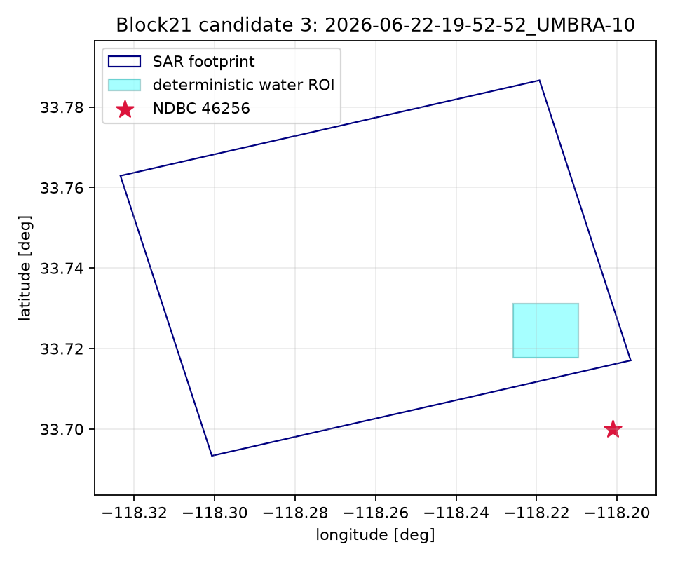

# Candidate 3 — 2026-06-22-19-52-52_UMBRA-10

- Collect: `407028c8-ed44-4823-b48a-d7242b63c281` at 2026-06-22T19:52:52.700000Z
- Complex path: SICD=True, CPHD=False; catalog duration 13.4 s (descriptor, not gate).
- Internal-water ROI: 1500 m square; edge clearance 1309.9 m; coast status `local_exact`.
- Measured reference: NDBC `46256`, 3.13 km, offset 427 s.
- Dominant same-band period: 13.33 s; propagation-to direction: 23.75674972366477 deg.
- Frequency readiness: **READY_FOR_SAR_METADATA_PREFLIGHT**. Bathymetry is not a selection gate.

