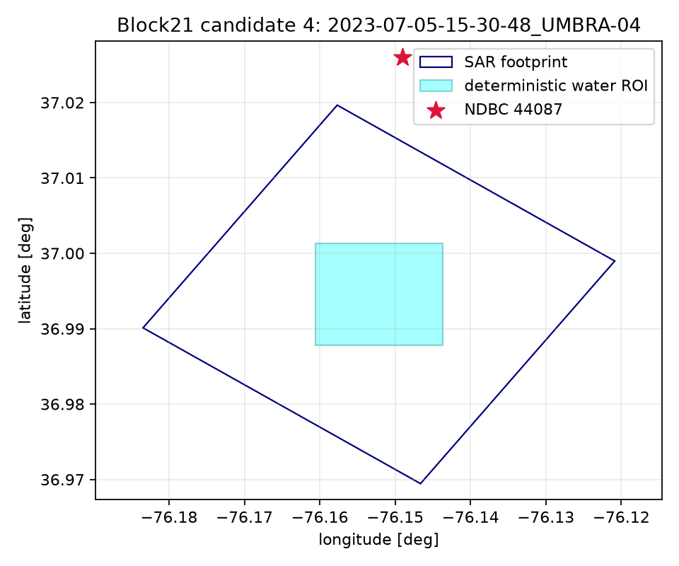

# Candidate 4 — 2023-07-05-15-30-48_UMBRA-04

- Collect: `5d3be8ac-cf8d-45e2-b7c1-a92cf70c3539` at 2023-07-05T15:30:48.400000Z
- Complex path: SICD=True, CPHD=True; catalog duration 2.800001 s (descriptor, not gate).
- Internal-water ROI: 1500 m square; edge clearance 1998.5 m; coast status `lower_bound_beyond_footprint`.
- Measured reference: NDBC `44087`, 3.51 km, offset 1752 s.
- Dominant same-band period: 4.76 s; propagation-to direction: 295.5508403140227 deg.
- Frequency readiness: **READY_FOR_SAR_METADATA_PREFLIGHT**. Bathymetry is not a selection gate.

