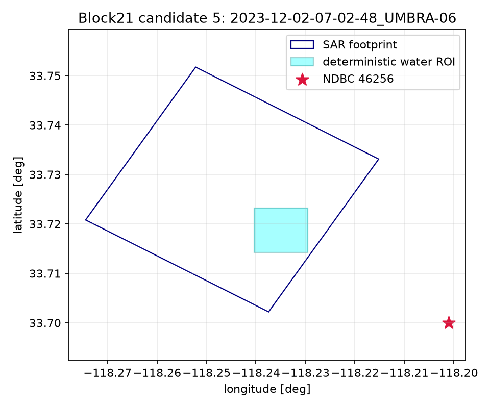

# Candidate 5 — 2023-12-02-07-02-48_UMBRA-06

- Collect: `d6be5aba-1186-4401-b2e8-defbeeb6fb20` at 2023-12-02T07:02:48.500000Z
- Complex path: SICD=True, CPHD=False; catalog duration 9.0 s (descriptor, not gate).
- Internal-water ROI: 1000 m square; edge clearance 743.8 m; coast status `local_exact`.
- Measured reference: NDBC `46256`, 3.77 km, offset -168 s.
- Dominant same-band period: 14.29 s; propagation-to direction: 32.0 deg.
- Frequency readiness: **READY_FOR_SAR_METADATA_PREFLIGHT**. Bathymetry is not a selection gate.

